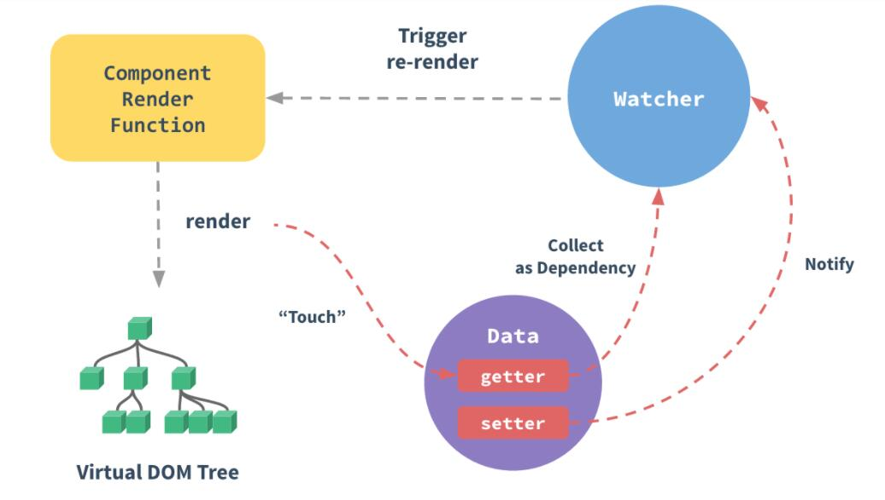

# 追踪变化
* 一个普通的 js 对象传入 Vue 实例作为 data 选项，Vue 将遍历此对象所有的 prototype，并使用 Object.defineProperty 把这个 prototype 全部转为 getter/setter。
* 这些 getter/setter 对用户来说是不可见的的，但是在内部他们让 Vue 能够追踪依赖，在 prototype 被访问和修改时通知变更
* 每个组件实例都对应一个 watcher 实例，它会在组件渲染的过程中把"接触"过的数据 prototype 记录为依赖。之后当依赖项的 setter 触发时，会通知 watcher，从而使它关联的组件重新渲染

# 追踪变化的注意事项
## 对于对象
* Vue 无法检测 prototype 的添加和移除。由于 Vue 会在初始化实例时对 prototype 执行 getter/setter 转化，所以 prototype 必须在 data 对象上存在才能让 Vue 将它转化为响应式
    * eg：
        ```javascript
            var vm = new Vue ({
                data: {
                    a: 1
                }
            })
            // vm.a 是响应式的

            vm.b = 2
            // vm.b 是非响应式
        ```
* 对于已经创建的实例，Vue 不允许动态添加根级别的响应式 prototype。但是可以使用 Vue.set(object, propertyName, value) 方法向嵌套对象添加响应式 property 
    * eg：
        ```javascript
            Vue.set(vm.someObject, 'b', 2)
        ```
* 还可以使用 vm.$set 实例方法，这也是全局 Vue.set 方法的别名
    * eg
        ```javascript
            this.$set(this.someObject, 'b', 2)
        ```
* 如果需要为已有对象赋值多个新 property，比如使用 Object.assign() 或者 _.extend()。但是，这样添加到对象上的新 property 不会触发更新。在这种情况下，用源对象与要混合进去的对象的 property 一起创建一个新的对象
    * eg
        ```javascript
            // 代替 Object.assign(this.someObject, {a: 1, b: 2})
            this.someObject = Object.assign({}, this.someObject, {a: 1, b: 2})
        ```

## 对于数组
* Vue 不能检测一下数组的变动：
    1. 当利用索引直接设置一个数组项时
        * eg：
            ```javascript
                vm.items[indexOfItem] = newValue
            ```
    2. 当修改数组的长度时
        * eg：
            ```javascript
                vm.items.length = newLength
            ```
    * eg：
        ```javascript
            var vm = new Vue ({
                data: {
                    items: ['a', 'b', 'c']
                }
            })
            vm.items[1] = 'x' // 不是响应式的
            vm.items.length = 2 // 不是响应式的
        ```
* 解决方案
    * 实现 vm.items[indexOfItem] = newValue，同时在响应式系统内触发状态更新
        1. Vue.set
            * eg：
                ```javascript
                    Vue.set(vm.items, indexOfItem, newValue)
                ```
        2. Array.prototype.splice
            * eg：
                ```javascript
                    vm.items.splice(indexOfItem, 1, newValue)
                ```
        3. 使用 vm.$set 实例方法，该方法是全局方法 Vue.set 的一个别名
            * eg：
                ```javascript
                    vm.$set(vm.items, indexOfItem, newValue)
                ```
    * 用 splice
        * eg：
            ```javascript
                vm.items.splice(newLength)
            ```